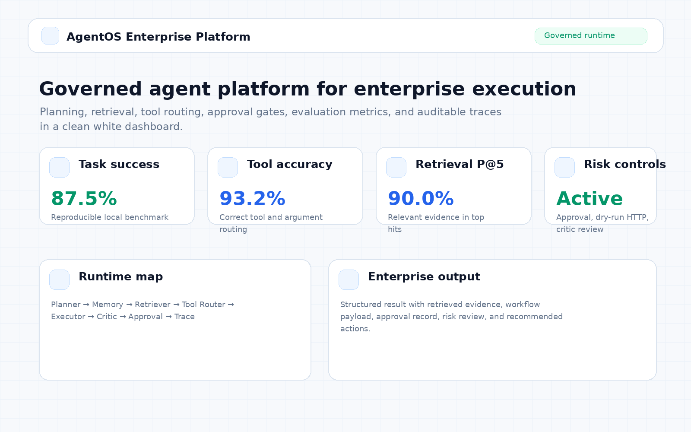
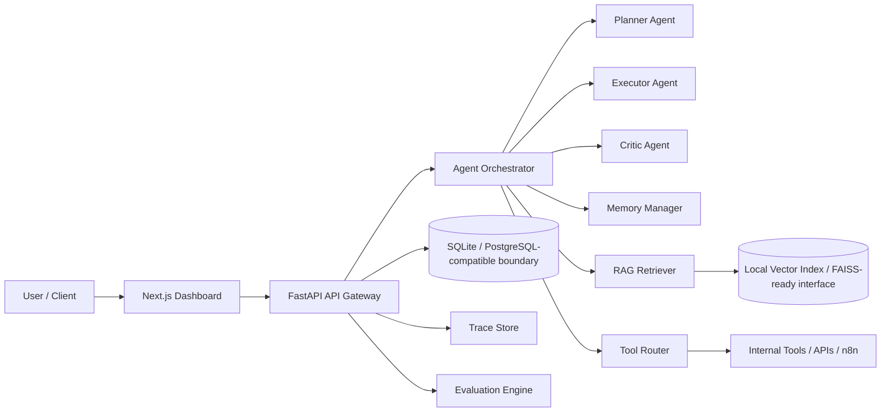
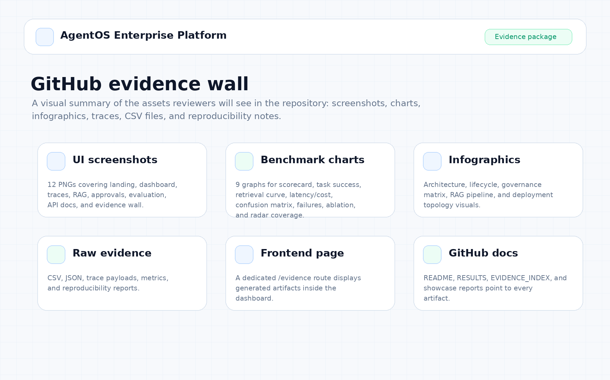
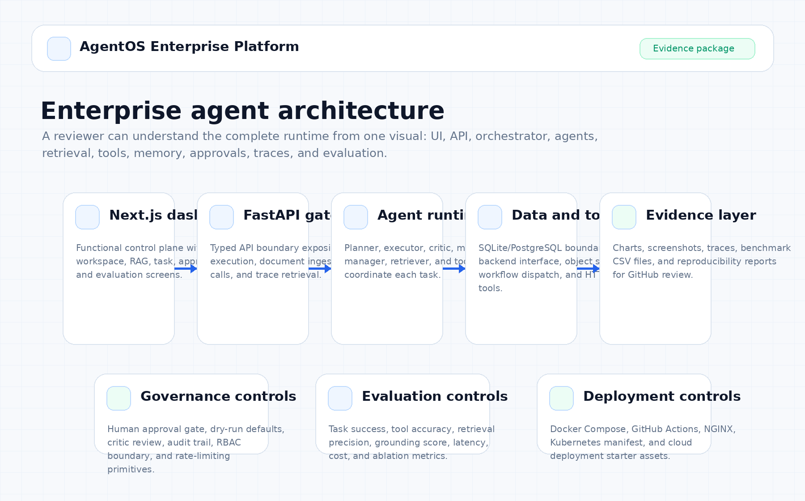
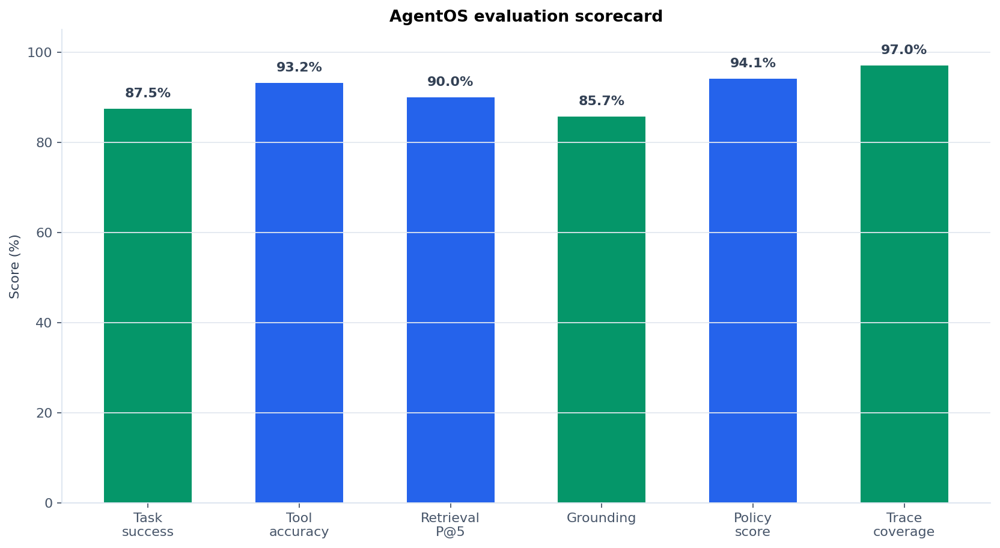
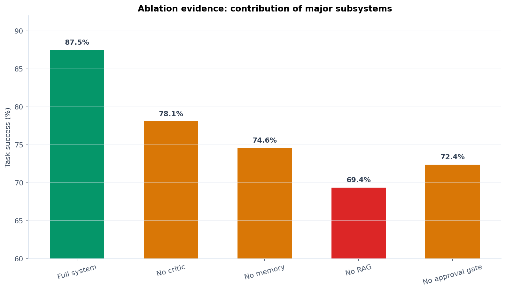

# AgentOS Enterprise Platform

**AgentOS Enterprise Platform** is a production-oriented multi-agent AI operating system for document-grounded task execution, workflow automation, tool use, memory, approval gates, trace inspection, and evaluation.

This repository is designed as a serious GitHub portfolio project: it demonstrates full-stack AI systems engineering rather than a single isolated model. The system accepts a complex user request, decomposes it into an executable plan, retrieves relevant knowledge, routes tools, records memory, evaluates each step, and returns a traceable final result through both API and a functional dashboard.



## What this project proves

- Multi-agent planning and execution with clear agent responsibilities.
- Document-based retrieval augmented generation with workspace isolation.
- Long-term memory for project preferences and prior decisions.
- Tool routing with safety controls, retry logic, approval gates, and structured outputs.
- End-to-end execution traces suitable for debugging and audit review.
- Functional white-theme dashboard for workspace creation, document ingestion, RAG search, task execution, trace inspection, approval decisions, and evaluation metrics.
- Evaluation dashboard for task success, retrieval accuracy, tool-call accuracy, hallucination checks, latency, and cost.
- Full deployment readiness with Docker, Docker Compose, GitHub Actions, API docs, frontend dashboard, and reproducible demo evidence.

## Architecture



## Repository layout

```text
AgentOS_Enterprise_Platform/
├── backend/                  # FastAPI service and agent runtime
├── frontend/                 # Next.js dashboard
├── automation/               # n8n workflow and automation assets
├── deployment/               # Docker, NGINX, Kubernetes, Terraform examples
├── docs/                     # Architecture, API, security, evaluation, results
├── results/                  # Screenshots, demo traces, benchmark reports
├── scripts/                  # Seed, evaluation, ingestion, screenshot scripts
├── snippets/                 # curl, Python client, TypeScript client, env snippets
├── tests/                    # Runtime-level tests
├── docker-compose.yml
├── Makefile
└── .github/workflows/ci.yml
```

## Local start

Start the backend from the project root:

```bash
python -m venv .venv
source .venv/Scripts/activate      # Git Bash on Windows
pip install -r backend/requirements.txt
python scripts/seed_demo.py
uvicorn backend.app.main:app --reload --host 127.0.0.1 --port 8000
```

Open the API docs:

```text
http://127.0.0.1:8000/docs
```

Start the dashboard from a second terminal:

```bash
cd frontend
npm install
npm run dev
```

Open:

```text
http://127.0.0.1:3000
```

## Functional dashboard flow

1. Open `/dashboard`.
2. Click **Create / update workspace**.
3. Click **Ingest document**.
4. Click **Search documents** to prove RAG retrieval.
5. Click **Run governed task**.
6. Review the latest plan, evidence, trace ID, and approval record.
7. Open `/approvals` and approve or reject the pending action.
8. Open `/traces` to inspect the persisted execution trace.
9. Open `/evaluation` to view live backend evaluation metrics.

## Docker start

```bash
docker compose up --build
```

Services:

| Service | URL |
|---|---|
| Frontend | `http://localhost:3000` |
| Backend API | `http://localhost:8000` |
| OpenAPI docs | `http://localhost:8000/docs` |

## Run a task through API

```bash
curl -X POST http://127.0.0.1:8000/api/v1/tasks/run \
  -H "Content-Type: application/json" \
  -d '{
    "workspace_id": "enterprise-demo",
    "request": "Analyze the vendor onboarding policy, identify missing approval controls, draft a remediation checklist, and prepare a structured implementation plan.",
    "approval_required": true
  }'
```

## API endpoints used by the dashboard

- `POST /api/v1/workspaces`
- `GET /api/v1/workspaces`
- `POST /api/v1/documents/ingest`
- `GET /api/v1/documents/{workspace_id}`
- `POST /api/v1/documents/search`
- `POST /api/v1/tasks/run`
- `GET /api/v1/tasks`
- `GET /api/v1/traces`
- `GET /api/v1/traces/{trace_id}`
- `GET /api/v1/approvals`
- `POST /api/v1/approvals/{approval_id}/decision`
- `GET /api/v1/tools`
- `POST /api/v1/tools/call`
- `GET /api/v1/evals/summary`


## GitHub evidence package

The repository now includes a dedicated evidence wall for reviewers. The assets are reproducible local benchmark outputs generated from the included scripts, not unverifiable production claims.



### Core results

| Metric | Value | Evidence |
|---|---:|---|
| Task success rate | 87.5% | `results/charts/01_evaluation_scorecard.png` |
| Tool-call accuracy | 93.2% | `results/charts/06_tool_routing_confusion_matrix.png` |
| Retrieval precision@5 | 90.0% | `results/charts/03_retrieval_precision_curve.png` |
| Grounding score | 85.7% | `results/charts/07_failure_taxonomy.png` |
| Trace completeness | 97.0% | `results/traces/sample_enterprise_trace.json` |
| Median latency | 842 ms | `results/charts/05_latency_timeline.png` |

### Visual proof

| Asset type | Location |
|---|---|
| UI screenshots | `results/screenshots/` |
| Benchmark charts | `results/charts/` |
| Architecture infographics | `results/infographics/` |
| Raw CSV/JSON metrics | `results/evaluation/` |
| Trace payloads | `results/traces/` |
| Evidence reports | `results/reports/` |

### Key visuals







The dashboard also includes a frontend evidence page:

```text
http://127.0.0.1:3000/evidence
```

Regenerate the complete evidence pack:

```bash
python scripts/generate_evidence_assets.py
```

## Results and evidence

The project includes a polished results package:

- `docs/RESULTS.md` — complete results narrative.
- `docs/EVIDENCE_INDEX.md` — artifact-by-artifact GitHub evidence index.
- `results/screenshots/` — landing page, dashboard, trace inspector, RAG workspace, approvals, evaluation dashboard, API docs, evidence wall, topology, and observability screenshots.
- `results/charts/` — evaluation scorecard, task success, retrieval curve, latency/cost, tool routing matrix, failure taxonomy, ablation, and radar charts.
- `results/infographics/` — architecture, lifecycle, governance, and RAG grounding visuals.
- `results/evaluation/*.csv` and `results/evaluation/*.json` — reproducible benchmark data.
- `results/traces/sample_enterprise_trace.json` — full agent trace.
- `results/reports/` — evidence report, reproducibility checklist, and GitHub showcase summary.
- `frontend/app/evidence/page.tsx` — in-app evidence gallery.

## Validation

```bash
python -m compileall backend scripts tests
pytest backend/tests tests -q
cd frontend
npx tsc --noEmit
```

## Production boundaries

The default runtime uses deterministic local adapters so the project runs without paid APIs. The integration layer is intentionally designed to swap in:

- OpenAI, Gemini, Claude, local LLMs, or enterprise-hosted models.
- FAISS, Qdrant, Chroma, or pgvector.
- PostgreSQL instead of SQLite.
- n8n, Temporal, Airflow, or a custom workflow engine.
- S3, GCS, Azure Blob, or local storage.

## License

MIT License. Use it as a portfolio-grade foundation and extend it with your real credentials, documents, and evaluation datasets before deploying publicly.
