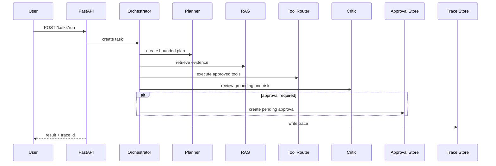

# Architecture

AgentOS Enterprise Platform follows a control-plane architecture. The API receives a complex request, creates a durable task record, and passes the request to the orchestrator. The orchestrator coordinates planner, retriever, memory manager, executor, tool router, critic, and approval manager.

## Runtime sequence

## Core components

| Component | Responsibility |
|---|---|
| Planner Agent | Converts a complex request into bounded, inspectable steps. |
| RAG Retriever | Finds workspace-specific evidence and returns scored excerpts. |
| Memory Manager | Recalls previous decisions and stores outcome summaries. |
| Tool Router | Chooses and executes tools through a registry boundary. |
| Executor Agent | Runs steps, calls tools, and creates structured outputs. |
| Critic Agent | Checks grounding, unresolved assumptions, and governance risks. |
| Approval Gate | Pauses risky or external actions until reviewed. |
| Trace Store | Preserves the complete execution path for audit and debugging. |

## Extension points

- Replace `LocalRagRetriever` with FAISS, Qdrant, Chroma, or pgvector.
- Replace SQLite repository with PostgreSQL while preserving repository methods.
- Replace deterministic local analysis with an enterprise LLM gateway.
- Replace workflow dispatch dry-run with n8n, Temporal, or Airflow execution.
- Add object storage through S3, GCS, Azure Blob, or MinIO.
